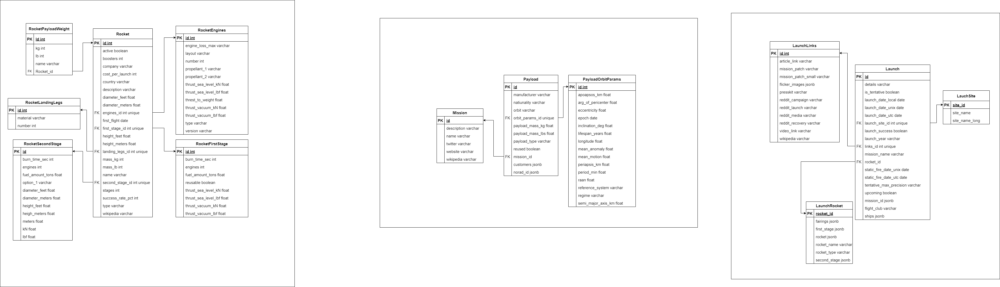

# Задание повышенной сложности на DE от Гринатома
1. Спроектировал модели (файл r_models.png в репозитории ) и витрины для РСУБД
2. Создал скрипт для создания таблиц с помощью sqlalchemy
3. Создал скрипт для загрузки данных spaceX
4. Создал скрипт для загрузки данных в Posgresql
5. Написал скрипт для создания витрины суммы публикаций (sum_publications). Публикацией считается url из разных 
источников кроме "reddit"
6. Создал скрипт для генерации фейковых данных(каждые 30 сек. по 15 строк)
7. Создал Dockerfile для скриптов и docker-compose.yml для всего сервиса

## запуск
```bash
docker compose up -d
```
NOTE: если контейнер spacex_loader вдруг при старте упал, перезапустите его, хоть и прописан depends_on проблема 
почему-то возникла на ноутбуке (а на ПК все ок в то же время, с проблемой не разобрался)

## учетные данные PostgreSQL
- логин: postgres
- пароль: password
- база данных: postgres

порт из контейнера 5432 открыт на локалхосте

## реляционная модель


## описание своих витрин из задания
### h_sum_reusable_fs_type_rocket
Сумма высоты всех переиспользуемых первых ступеней для типа Ракеты 'rocket'
### avg_num_legs_type_rocket_group_material
Среднее количество LandingLegs для Ракеты типа 'rocket', сгруппированных по материалу
